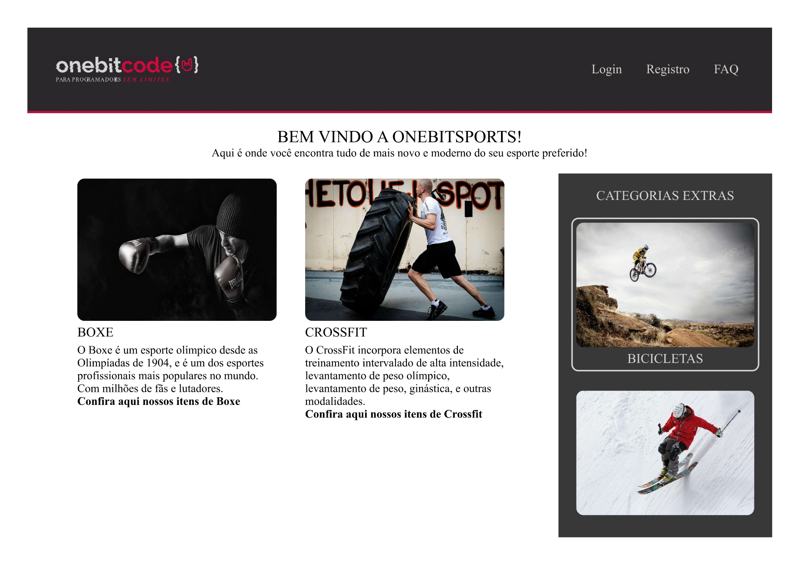

### Hi there! 👋

> This project it's a exercise that simulate a sports web-site.


## What is inside?

- HTML
- CSS3 
- Flexbox
- Grid Layout
- Prettier
- Media Queries

## Getting Started

### Install dependencies:

```bash
yarn
```

or

```bash
npm install
```

Open [http://localhost:3000](http://localhost:3000) with your browser to see the result.

## Structure

```
└── src
    ├── components
    ├── pages
    ├── styles
```

| Folder              | Description                                      |
| ----------          | -------------------------------------------      |
| **components**      | Page components                                  |
| **pages**           | Page components                                  |
| **styles**          | Application styles                               |

<p align="center">Made with 💜 by Mario</p>
